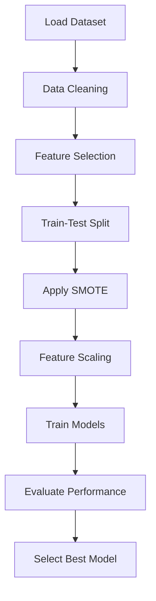

# 📊 Fraud Detection in Blockchain Transactions

---

## 📌 Project Overview

This project focuses on detecting fraudulent transactions in blockchain data using Machine Learning techniques.
Due to the highly imbalanced nature of fraud datasets, preprocessing and resampling techniques are applied to improve model performance.

---

## 🎯 Objectives

* Detect fraudulent transactions from blockchain data
* Handle class imbalance effectively
* Compare multiple machine learning models
* Identify the best-performing model

---

## 📂 Dataset

* File used: `transaction_dataset.csv`
* Target column: `FLAG`

  * `0` → Normal transaction
  * `1` → Fraudulent transaction

---

## ⚙️ Tech Stack

| Category           | Tools                    |
| ------------------ | ------------------------ |
| Language           | Python                   |
| Data Processing    | Pandas, NumPy            |
| Visualization      | Matplotlib               |
| ML Models          | Scikit-learn             |
| Imbalance Handling | Imbalanced-learn (SMOTE) |

---

## 🔄 Workflow

---

## 🧹 Data Preprocessing

* Removed unnecessary column (`Unnamed: 0`)
* Removed constant features
* Removed duplicate records
* Dropped categorical columns
* Removed features with >90% zero values
* Handled missing values using mean imputation

---

## ⚖️ Handling Imbalanced Data

* Applied **SMOTE (Synthetic Minority Oversampling Technique)**
* Balanced fraud and non-fraud classes
* Visualized class distribution before and after SMOTE

---

## 🤖 Models Implemented

* Logistic Regression
* Decision Tree
* Random Forest
* Support Vector Machine (SVM)

---

## 📊 Evaluation Metrics

* Accuracy
* Precision
* Recall
* F1 Score

---

## 📈 Results

| Model               | Accuracy | Precision | Recall   | F1 Score |
| ------------------- | -------- | --------- | -------- | -------- |
| Logistic Regression | 0.76     | 0.47      | 0.89     | 0.62     |
| Decision Tree       | 0.97     | 0.92      | 0.95     | 0.93     |
| Random Forest       | **0.99** | **0.98**  | **0.96** | **0.97** |
| SVM                 | 0.85     | 0.60      | 0.95     | 0.74     |

---

## 🏆 Best Model

### ✅ Random Forest

* Highest F1 Score
* High Precision → fewer false positives
* High Recall → detects most fraud cases

---

## ⚠️ Challenges

* Highly imbalanced dataset
* Presence of irrelevant/sparse features
* Feature selection complexity

---

## 🚀 Future Improvements

* Hyperparameter tuning
* Feature importance analysis
* Advanced models (XGBoost, Deep Learning)
* Real-time fraud detection system

---

## 👨‍💻 Author

**Pragadheesh Chandramohan**
